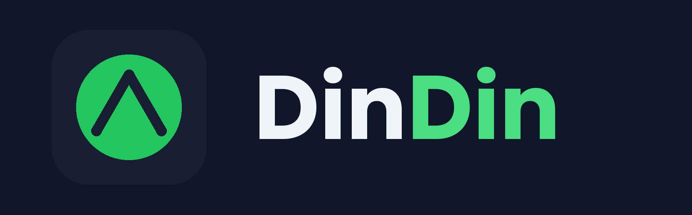

<p align="center">
  
</p>

# DinDin 💰

App mobile de controle financeiro pessoal, desenvolvido em Flutter como projeto acadêmico da disciplina de Programação de Dispositivos Móveis.

O projeto está estruturado em 4 fases progressivas:

- **Fase 1 (MVP):** controle financeiro básico — cadastro de transações, categorias, saldo, histórico, edição/exclusão, autenticação e banco de dados local
- **Fase 2 (Análises):** gráficos e relatórios visuais sobre os gastos do usuário
- **Fase 3 (Recursos inteligentes):** metas financeiras, limites por categoria, alertas e previsão de saldo
- **Fase 4 (Assistente financeiro):** chat integrado ao app, capaz de responder perguntas sobre a situação financeira do usuário

## 🚀 Tecnologias

- **Framework:** [Flutter](https://flutter.dev) (Dart)
- **Gerenciamento de estado:** [Provider](https://pub.dev/packages/provider)
- **Persistência local:** SQLite via [sqflite](https://pub.dev/packages/sqflite)
- **Backend/nuvem:** [Firebase](https://firebase.google.com) (Authentication + Firestore)

## 🔄 Arquitetura offline-first

O app funciona normalmente sem internet. Toda transação é salva **primeiro no SQLite local**, e a tela sempre lê dele, então nada trava esperando a rede.

A sincronização com a nuvem acontece em segundo plano:

1. Cada transação local tem uma marcação de "sincronizada" (sim/não).
2. Ao fazer login, e a cada transação criada, editada ou excluída, o app tenta enviar as pendências para o Cloud Firestore.
3. Sem conexão, o envio falha silenciosamente. Os dados continuam salvos no aparelho e são reenviados na próxima tentativa.
4. Ao logar em um aparelho novo, o app baixa da nuvem as transações que ainda não existem localmente.

Os dados de cada usuário ficam em `users/{uid}/transactions/{id}` no Firestore, e as regras de segurança (`firestore.rules`) só permitem que o usuário acesse o próprio caminho.

## 🎨 Identidade visual

| Cor      | Hex       | Uso                                |
| -------- | --------- | ---------------------------------- |
| Verde    | `#22C55E` | Receitas, ações positivas          |
| Navy     | `#172033` | Cards de destaque (ex: saldo)      |
| Azul     | `#2563EB` | Categorias, elementos informativos |
| Âmbar    | `#F59E0B` | Categorias, alertas                |
| Vermelho | `#EF4444` | Despesas, alertas críticos         |

Tipografia: **Poppins**

### Modo escuro

| Elemento                 | Claro     | Escuro                        |
| ------------------------ | --------- | ----------------------------- |
| Fundo geral              | `#F8FAFC` | `#0F172A`                     |
| Fundo dos cards          | `#FFFFFF` | `#1E293B`                     |
| Texto principal          | `#172033` | `#F1F5F9`                     |
| Texto secundário         | `#94A3B8` | `#94A3B8`                     |
| Verde (receitas)         | `#22C55E` | `#4ADE80`                     |
| Vermelho (despesas)      | `#EF4444` | `#F87171`                     |
| Azul (categorias)        | `#2563EB` | `#60A5FA`                     |
| Âmbar (alertas)          | `#F59E0B` | `#FBBF24`                     |
| Card de saldo (destaque) | `#172033` | `#1E293B` com borda `#334155` |

As cores de destaque (verde, vermelho, azul, âmbar) são clareadas no modo escuro para manter contraste e legibilidade sobre o fundo escuro, seguindo a mesma prática de design systems como o Material Design.

## 📁 Estrutura do projeto

```
lib/
├── main.dart              # ponto de entrada do app e AuthGate (login ou dashboard)
├── firebase_options.dart  # configuração do Firebase (gerada pelo FlutterFire CLI)
├── models/                # modelos de dados (transações, categorias)
├── database/              # persistência local (SQLite)
├── providers/             # gerenciamento de estado (Provider)
├── services/              # integrações externas (Firebase Auth, Firestore, biometria)
├── screens/               # telas do app (login, dashboard, histórico, cadastro, etc.)
├── widgets/               # componentes reutilizáveis (card de saldo, item de transação)
└── theme/                 # paleta de cores centralizada
```

## ⚙️ Como rodar o projeto

1. Tenha o [Flutter SDK](https://docs.flutter.dev/get-started/install) instalado e configurado (`flutter doctor` sem erros)
2. Clone o repositório:

```
git clone https://github.com/itsAGBS/DinDin.git
cd DinDin
```

3. Instale as dependências:

```
flutter pub get
```

4. Rode o app (emulador Android ou dispositivo físico com depuração USB ativada):

```
flutter run
```

O app foi testado em Android.

### ⚠️ Login com Google em outra máquina

O login com e-mail e senha funciona logo após clonar o projeto. O **login com Google** exige que o SHA-1 do certificado de debug de cada computador esteja cadastrado no Firebase Console (senão o app mostra o erro `sign_in_failed`).

Para descobrir o seu SHA-1:

```
cd android
./gradlew signingReport
```

(no PowerShell do Windows, use `.\gradlew signingReport`). Copie o valor de `SHA1` da variante `debug` e envie para o líder do projeto, que cadastra em *Configurações do projeto → Android → Adicionar impressão digital*.

## 👥 Equipe

| Integrante                          | Responsabilidade na Fase 1                                                                         |
| ----------------------------------- | -------------------------------------------------------------------------------------------------- |
| Adalberto Gabriel Barros de Santana | Banco de dados local, Login/cadastro de usuário, Sincronização em nuvem, Criar logo e ícone do app |
| Jeferson Mateus dos Santos Baptista | Categorias, Cadastro de receitas/despesas, Edição/exclusão, Aprimorar design visual do app         |
| Cauã Henrique Veras da Cruz         | Histórico de transações, Saldo atual, Dashboard                                                    |
| Vitor Luiz De Morais Alecrim        | Autenticação por biometria/PIN, Tela de configurações                                              |

## 📋 Gerenciamento do projeto

O andamento do projeto é acompanhado via Kanban, organizado por fase e revisado com o professor orientador.

O fluxo de trabalho no Git segue o padrão: uma branch por funcionalidade, Pull Request descrevendo a mudança, revisão do líder do projeto e merge na `main`.

## 📄 Licença

Projeto acadêmico desenvolvido para fins educacionais.
